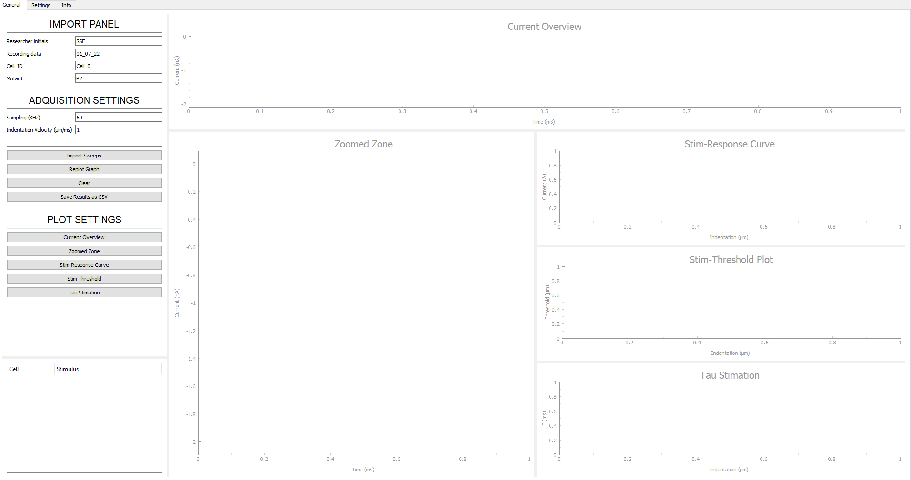
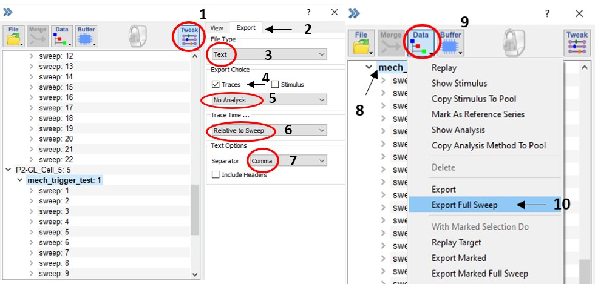

# **MECHANO-GATED CHANNELS ELECTROPHYSIOLOGYCAL PROPERTIES**

Analysis program based on Python3 for Electrophysiological experiments of Mechano-Gated Channels.

TABLE OF CONTENTS
1. INTRODUCTION
   1. Our Code takes the exported data from PatchMaster Next Software (HEKA Electronik, USA) and analyzes all the currents generated by a cell, after a mechanical stimuli (indentation). 
   2. The software has a friendly Graphical User Interface (GUI) by which the data is easily imported and analyzed.
    
   
2. MAIN PYTHON 3 PACKAGES
   
   *The following packages have to be compulsorily installed in your PAHT, for the correct software functioning.* 
   1. [Numpy](https://numpy.org/)
   2. [Pandas](https://pandas.pydata.org/)
   3. [Scipy](https://scipy.org/)
   4. [Pyqtgraph](https://www.pyqtgraph.org/)
   5. [PyQT5](https://pypi.org/project/PyQt5/)
   6. [pyqt5-tools](https://pypi.org/project/pyqt5-tools/)
3. DATA FORMAT

   1. Our program can not process the .DAT files from HEKA software, so the recordings have to be exported to .ASC file format as shown bellow.
   
   *(Steps (1-7) need to be followed only once.)*
      1. Press Tweak Button
      2. Select Export Tab.
      3. On File Type Select: **Text**.
      4. Export Choice Select: **Traces** Check-Box only.
      5. Export Choice Select: **NO analysis**.
      6. Trace Time: **Relative to Swepp**.
      7. Text Options: Separator (**Comma**).
      8. Tree Widget:  Select the Sweep to export.
      9. Press **Data** Button.
      10. Export as **Full Sweep.**
   
   
4. DATA PREPARATION
   1. Every trace have to be aligned to its sitmuli, leak substracted and linked to its respective indentation value, before any analysis.
   
      1. ALIGMENT
         1. We extract the index of the first stimulus peak for each trace. (Both traces share their indexes.)
         2. We stablish this index as a reference point in the current traces.
         3. We trimed all current traces using the reference point to get the same lenth in all traces.
      2. LEAK SUBSTRACTION
         1. We select a region from each current trace inactive zone.
         2. We stimate the mean of these regions individually.
         3. We substract the mean value calculated before (leak) of each trace to the original one.
      3. INDENTATION LEVEL LINKING
         1. We generate a dictioray with every indentation levels in μm previously.
         2. We divide in two all stimulus traces to extrac the number of stim peaks. (The division is nevesary due to the nanomotor functioning.)
         3. We use as in index the number of peaks calculated above to extrac each respective indentation value from the dictionay.
         4. We generate a dictionary with all current traces sorted by their indentation values.

5. CHANNEL PARAMETERS
   1. CURRENT RESPONSE
      1. We take the dictionary generated previously with all current traces ready to stimate the desired parameters.
      2. We calculate the minimum current value of each trace, as these are the current peaks generated in response of each stimulus.
   2. THRESHOLD
      1. We extract the index of the first stimulus peak, to trim the aligned and leak substracted traces from this point.
      2. We calculte the mean and standard deviation from a inactive region of each current trace after the stimulus.
      3. mean and sd are used to set a threshold (mean+10*sd), to determine when the current response starts.
      4. If the current value is greather than our threshold, the index of this current value is saved.
      5. The threshold in µm is caluculated multiplying the index extracted by the indentaiton velocity and dividing all by the sampling ratio.
   3. INACTIVATION KINETICS (TAU)
      1. We find the index of the first stimulus peak to trim the current trace, as we have done previously.
      2. We stimate the initial guessings for the parameters a and c of the exponential fit model (b was previously calculated with a current trace model).
      3. The current trace was trimmed again from the minimal current value, since to adjust our data to an exponential fit only need to evaluate the region from the current peak until it becomes inactive again.
      4. Exponential model was stimated and ploted along with the current trace in the zoomed zone plot.
      5. Tau value in ms is calculated using the optimal b parameter returned by the curve fit function (Scipy). Multiplying the invers of the b value by the sampling ratio in KHz.
      6. The tau value is only considered if it is between 1 and 50 ms, and the rSquared of the fiting model is greater than 0.6.
6. RESULTS
   1. All the channel parameters can be exported as independient CSV files.
